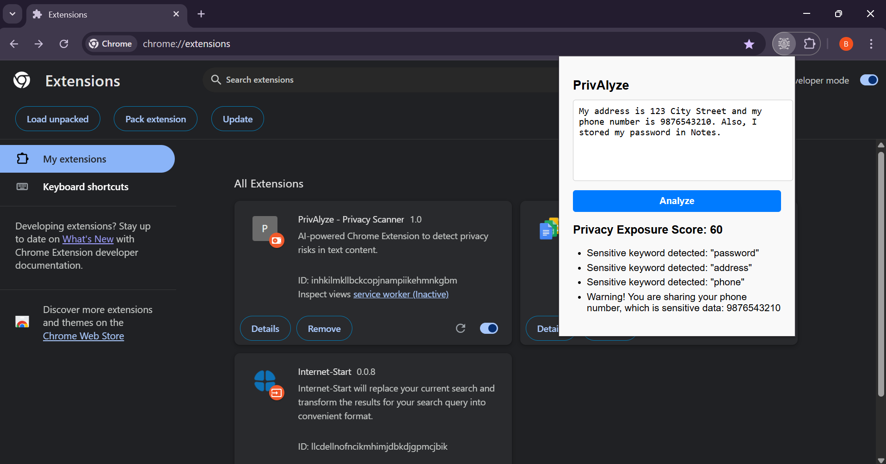
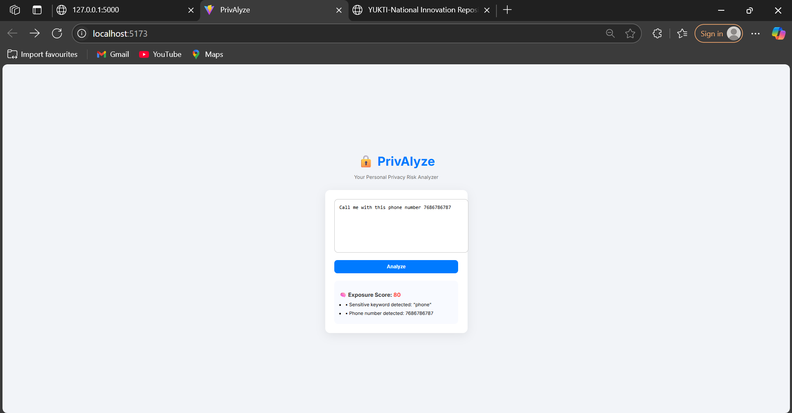

# 🕵️‍♀️ PrivAlyze – Privacy Risk Analyzer Chrome Extension

PrivAlyze is a Chrome extension that helps users analyze and detect sensitive or personally identifiable information (PII) in their text content. It alerts users in real-time about potential privacy risks before they submit data online.

---

## 🚀 Features

- 🔍 Scans text for sensitive information (e.g., passwords, phone numbers, addresses)
- ⚠️ Provides a **Privacy Exposure Score** based on detected terms
- 🧠 Smart detection using Flask-powered backend API
- 🧩 Easy-to-use UI via Chrome Extension popup
- 🌐 Cross-platform – works with React frontend & Flask backend

---

## 📸 Screenshots

| Popup UI | Detection Result |
|----------|------------------|
|  |  |

---

## 🛠️ Tech Stack

- **Frontend:** HTML, CSS, JavaScript (Chrome Extension)
- **Backend:** Python, Flask (REST API)
- **Tools:** Git, Chrome Developer Tools

